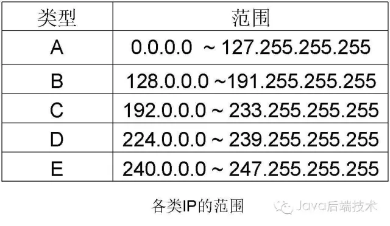
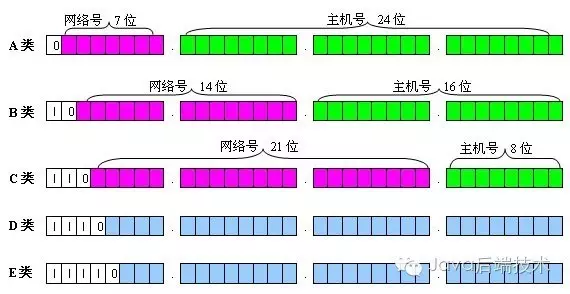
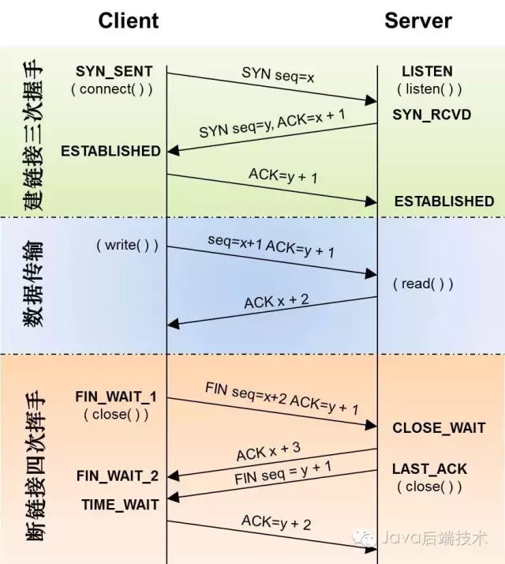
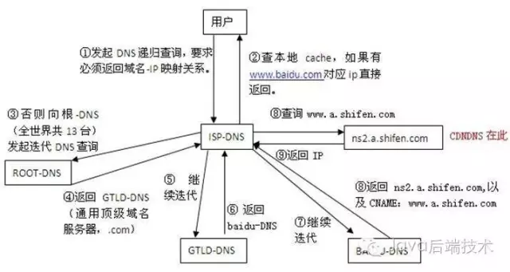
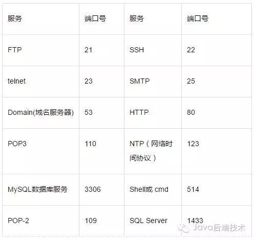

计算机网络基础几道常见面试试题

---------------

# **Java后端技术** 

1、OSI，TCP/IP，五层协议的体系结构，以及各层协议

OSI分层 （7层）：物理层、数据链路层、网络层、传输层、会话层、表示层、应用层。

TCP/IP分层（4层）：网络接口层、 网际层、运输层、 应用层。

五层协议 （5层）：物理层、数据链路层、网络层、运输层、 应用层。

  

每一层的协议如下：

物理层：RJ45、CLOCK、IEEE802.3    （中继器，集线器，网关）；

数据链路：PPP、FR、HDLC、VLAN、MAC  （网桥，交换机）；

网络层：IP、ICMP、ARP、RARP、OSPF、IPX、RIP、IGRP、 （路由器）；

传输层：TCP、UDP、SPX；

会话层：NFS、SQL、NETBIOS、RPC；

表示层：JPEG、MPEG、ASII；

应用层：FTP、DNS、Telnet、SMTP、HTTP、WWW、NFS；

  

每一层的作用如下：

物理层：通过媒介传输比特,确定机械及电气规范（比特Bit）

数据链路层：将比特组装成帧和点到点的传递（帧Frame）

网络层：负责数据包从源到宿的传递和网际互连（包PackeT）

传输层：提供端到端的可靠报文传递和错误恢复（段Segment）

会话层：建立、管理和终止会话（会话协议数据单元SPDU）

表示层：对数据进行翻译、加密和压缩（表示协议数据单元PPDU）

应用层：允许访问OSI环境的手段（应用协议数据单元APDU）

**2、IP地址的分类**

A类地址：以0开头， 第一个字节范围：0~127（1.0.0.0 - 126.255.255.255）；

B类地址：以10开头，第一个字节范围：128~191（128.0.0.0 - 191.255.255.255）；

C类地址：以110开头，第一个字节范围：192~223（192.0.0.0 - 223.255.255.255）；

10.0.0.0—10.255.255.255，172.16.0.0—172.31.255.255， 192.168.0.0—192.168.255.255。（Internet上保留地址用于内部）

IP地址与子网掩码相与得到主机号

  
  

**3、TCP三次握手和四次挥手的全过程**

三次握手：

第一次握手：客户端发送syn包(syn=x)到服务器，并进入SYN\_SEND状态，等待服务器确认；

第二次握手：服务器收到syn包，必须确认客户的SYN（ack=x+1），同时自己也发送一个SYN包（syn=y），即SYN+ACK包，此时服务器进入SYN\_RECV状态；

第三次握手：客户端收到服务器的SYN＋ACK包，向服务器发送确认包ACK(ack=y+1)，此包发送完毕，客户端和服务器进入ESTABLISHED状态，完成三次握手。

握手过程中传送的包里不包含数据，三次握手完毕后，客户端与服务器才正式开始传送数据。理想状态下，TCP连接一旦建立，在通信双方中的任何一方主动关闭连接之前，TCP 连接都将被一直保持下去。

四次握手

与建立连接的“三次握手”类似，断开一个TCP连接则需要“四次握手”。

第一次挥手：主动关闭方发送一个FIN，用来关闭主动方到被动关闭方的数据传送，也就是主动关闭方告诉被动关闭方：我已经不 会再给你发数据了(当然，在fin包之前发送出去的数据，如果没有收到对应的ack确认报文，主动关闭方依然会重发这些数据)，但是，此时主动关闭方还可 以接受数据。

第二次挥手：被动关闭方收到FIN包后，发送一个ACK给对方，确认序号为收到序号+1（与SYN相同，一个FIN占用一个序号）。  
第三次挥手：被动关闭方发送一个FIN，用来关闭被动关闭方到主动关闭方的数据传送，也就是告诉主动关闭方，我的数据也发送完了，不会再给你发数据了。  
第四次挥手：主动关闭方收到FIN后，发送一个ACK给被动关闭方，确认序号为收到序号+1，至此，完成四次挥手。

  

**4、各种协议**  

ICMP协议： 因特网控制报文协议。它是TCP/IP协议族的一个子协议，用于在IP主机、路由器之间传递控制消息。

TFTP协议： 是TCP/IP协议族中的一个用来在客户机与服务器之间进行简单文件传输的协议，提供不复杂、开销不大的文件传输服务。

HTTP协议： 超文本传输协议，是一个属于应用层的面向对象的协议，由于其简捷、快速的方式，适用于分布式超媒体信息系统。

DHCP协议： 动态主机配置协议，是一种让系统得以连接到网络上，并获取所需要的配置参数手段。

NAT协议：网络地址转换属接入广域网(WAN)技术，是一种将私有（保留）地址转化为合法IP地址的转换技术，

DHCP协议：一个局域网的网络协议，使用UDP协议工作，用途：给内部网络或网络服务供应商自动分配IP地址，给用户或者内部网络管理员作为对所有计算机作中央管理的手段。

  

**5、在浏览器中输入www.baidu.com后执行的全部过程**

1、客户端浏览器通过DNS解析到www.baidu.com的IP地址220.181.27.48，通过这个IP地址找到客户端到服务器的路径。客户端浏览器发起一个HTTP会话到220.161.27.48，然后通过TCP进行封装数据包，输入到网络层。

2、在客户端的传输层，把HTTP会话请求分成报文段，添加源和目的端口，如服务器使用80端口监听客户端的请求，客户端由系统随机选择一个端口如5000，与服务器进行交换，服务器把相应的请求返回给客户端的5000端口。然后使用IP层的IP地址查找目的端。

3、客户端的网络层不用关系应用层或者传输层的东西，主要做的是通过查找路由表确定如何到达服务器，期间可能经过多个路由器，这些都是由路由器来完成的工作，我不作过多的描述，无非就是通过查找路由表决定通过那个路径到达服务器。

4、客户端的链路层，包通过链路层发送到路由器，通过邻居协议查找给定IP地址的MAC地址，然后发送ARP请求查找目的地址，如果得到回应后就可以使用ARP的请求应答交换的IP数据包现在就可以传输了，然后发送IP数据包到达服务器的地址。

  

**6、TCP和UDP的区别？**

TCP提供面向连接的、可靠的数据流传输，而UDP提供的是非面向连接的、不可靠的数据流传输。

TCP传输单位称为TCP报文段，UDP传输单位称为用户数据报。

TCP注重数据安全性，UDP数据传输快，因为不需要连接等待，少了许多操作，但是其安全性却一般。

  

**7、TCP对应的协议和UDP对应的协议**

TCP对应的协议：

（1） FTP：定义了文件传输协议，使用21端口。

（2） Telnet：一种用于远程登陆的端口，使用23端口，用户可以以自己的身份远程连接到计算机上，可提供基于DOS模式下的通信服务。

（3） SMTP：邮件传送协议，用于发送邮件。服务器开放的是25号端口。

（4） POP3：它是和SMTP对应，POP3用于接收邮件。POP3协议所用的是110端口。

（5）HTTP：是从Web服务器传输超文本到本地浏览器的传送协议。

UDP对应的协议：  

（1） DNS：用于域名解析服务，将域名地址转换为IP地址。DNS用的是53号端口。

（2） SNMP：简单网络管理协议，使用161号端口，是用来管理网络设备的。由于网络设备很多，无连接的服务就体现出其优势。

（3） TFTP(Trival File Tran敏感词er Protocal)，简单文件传输协议，该协议在熟知端口69上使用UDP服务。

  

**8、DNS域名系统，简单描述其工作原理。**

当DNS客户机需要在程序中使用名称时，它会查询DNS服务器来解析该名称。客户机发送的每条查询信息包括三条信息：包括：指定的DNS域名，指定的查询类型，DNS域名的指定类别。基于UDP服务，端口53. 该应用一般不直接为用户使用，而是为其他应用服务，如HTTP，SMTP等在其中需要完成主机名到IP地址的转换。

  

  

**9、TCP的三次握手过程？为什么会采用三次握手，若采用二次握手可以吗？**

答：建立连接的过程是利用客户服务器模式，假设主机A为客户端，主机B为服务器端。

（1）TCP的三次握手过程：主机A向B发送连接请求；主机B对收到的主机A的报文段进行确认；主机A再次对主机B的确认进行确认。

（2）采用三次握手是为了防止失效的连接请求报文段突然又传送到主机B，因而产生错误。失效的连接请求报文段是指：主机A发出的连接请求没有收到主机B的确认，于是经过一段时间后，主机A又重新向主机B发送连接请求，且建立成功，顺序完成数据传输。考虑这样一种特殊情况，主机A第一次发送的连接请求并没有丢失，而是因为网络节点导致延迟达到主机B，主机B以为是主机A又发起的新连接，于是主机B同意连接，并向主机A发回确认，但是此时主机A根本不会理会，主机B就一直在等待主机A发送数据，导致主机B的资源浪费。

（3）采用两次握手不行，原因就是上面说的实效的连接请求的特殊情况。

  

**10、端口及对应的服务？**

